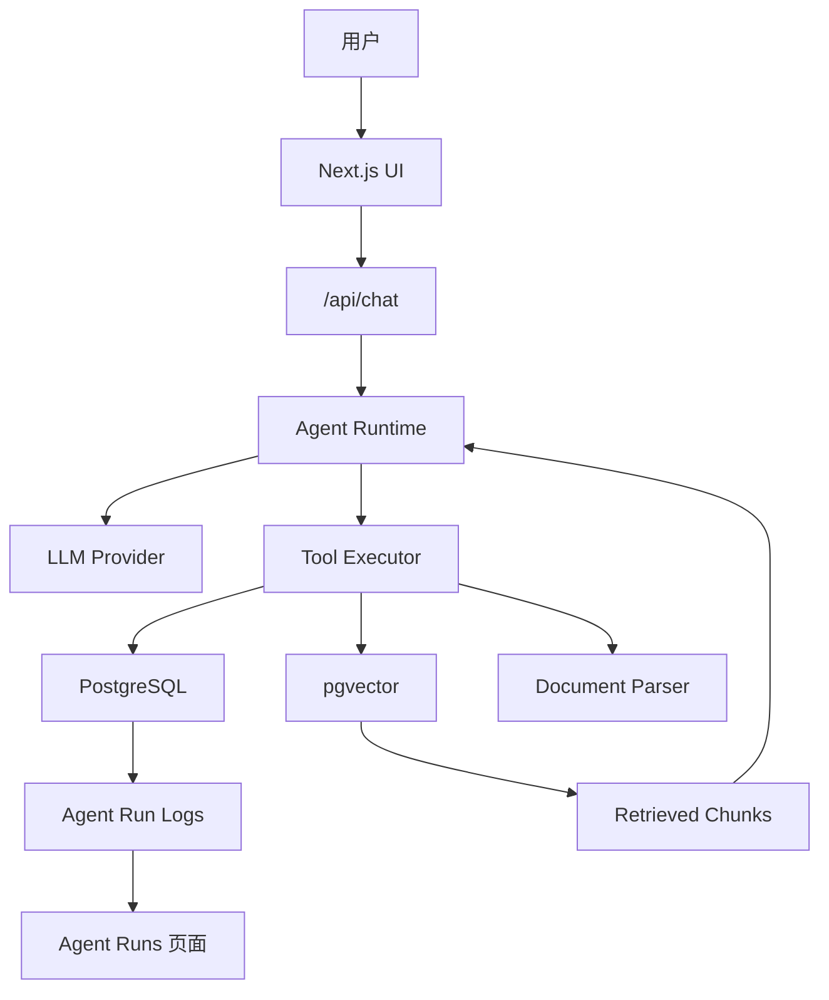
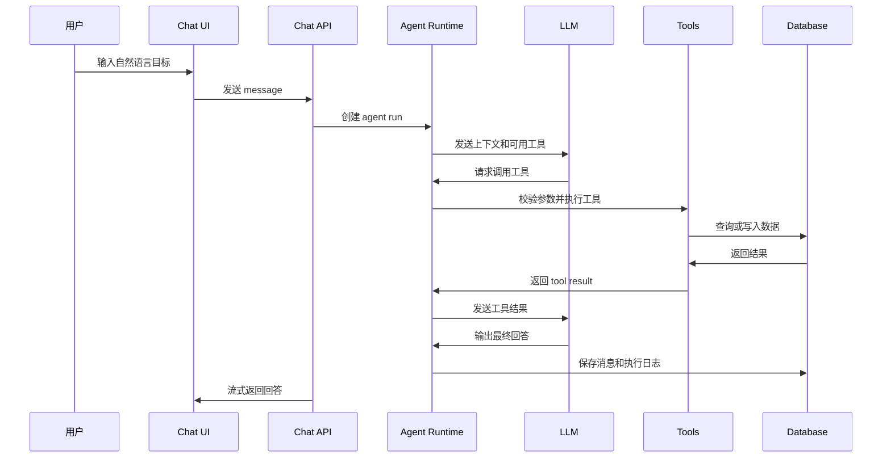

# 任务与知识库 Agent 完整开发计划

## 1. 项目定位

做一个个人工作区 Agent，核心能力是：

- 管理任务
- 管理文档/笔记
- 基于资料问答
- 从对话中创建任务
- 根据任务和资料生成每日计划
- 展示 Agent 的工具调用过程，方便调试

它不是普通聊天机器人。它应该能调用真实工具、读写数据库、检索资料、更新任务状态，并把每次行动记录下来。

## 2. MVP 是什么

MVP 是 Minimum Viable Product，中文一般叫“最小可行产品”。

意思不是“做得很简陋”，而是：

用最小范围做出一个能验证核心价值的版本。

这个项目的核心价值是：

```text
用户可以通过自然语言，让 Agent 同时处理任务和知识库。
```

所以第一版不需要做复杂权限、多租户、高级图表、插件市场、多 Agent 协作。第一版只要证明：

- Agent 能理解用户意图
- Agent 能查资料
- Agent 能创建/更新任务
- Agent 能基于真实数据生成计划
- 用户能看到 Agent 做了什么

## 3. MVP 范围

## 页面

必须有：

- Chat：主对话界面
- Documents：上传和管理文档
- Tasks：任务列表和状态管理
- Agent Runs：查看工具调用和执行日志

可以后置：

- 登录
- 多工作区
- 文件夹系统
- 高级标签
- 统计图表
- 移动端深度优化

## Agent 工具

第一版工具：

- searchDocs(query)
- createTask(title, priority, dueDate)
- listTasks(status)
- updateTask(id, status)
- generateDailyPlan(date)

第二版工具：

- summarizeDocument(documentId)
- extractTasksFromDocument(documentId)
- reviseDailyPlan(feedback)
- rememberPreference(key, value)

## 4. 推荐技术栈

前端与服务端：

- Next.js
- React
- TypeScript
- Tailwind CSS
- shadcn/ui
- lucide-react

数据库：

- PostgreSQL
- pgvector
- Drizzle 或 Prisma

AI：

- OpenAI-compatible client
- DeepSeek / OpenAI / Gemini provider adapter
- embedding provider

工具校验：

- Zod

部署：

- Vercel
- 托管 PostgreSQL

## 5. 系统架构



## 6. Agent 执行流程



## 7. 数据模型草案

users：

- id
- name
- email
- created_at

conversations：

- id
- user_id
- title
- created_at
- updated_at

messages：

- id
- conversation_id
- role
- content
- model
- token_input
- token_output
- created_at

tasks：

- id
- user_id
- title
- description
- status
- priority
- due_date
- source_message_id
- created_at
- updated_at

documents：

- id
- user_id
- filename
- mime_type
- status
- created_at

document_chunks：

- id
- document_id
- chunk_index
- content
- embedding
- metadata
- created_at

agent_runs：

- id
- user_id
- conversation_id
- status
- model
- started_at
- finished_at
- error

tool_calls：

- id
- agent_run_id
- tool_name
- arguments
- result
- status
- started_at
- finished_at
- error

## 8. 页面原型

## 8.1 Chat 页面

目标：这是主工作台，用户大部分时间都在这里。

布局：

```text
┌──────────────────────────────────────────────────────────────┐
│ 顶部栏：Workspace Agent                         模型 / 设置 │
├───────────────┬──────────────────────────────┬───────────────┤
│ 左侧导航       │ 中间聊天区                    │ 右侧上下文面板 │
│               │                              │               │
│ Chat          │ 用户消息                      │ 今日任务       │
│ Documents     │ Agent 回复                    │ 引用资料       │
│ Tasks         │ 工具调用状态                  │ 最近工具调用   │
│ Agent Runs    │ 输入框 + 附件 + 发送按钮       │               │
└───────────────┴──────────────────────────────┴───────────────┘
```

关键组件：

- Chat message list
- Tool call status block
- Streaming response
- Composer input
- Model selector
- Context side panel

交互：

- 用户输入“帮我把这份文档整理成今天要做的任务”
- Agent 先调用 searchDocs 或读取指定文档
- 再调用 createTask
- 回复中展示创建了哪些任务
- 右侧面板显示本轮引用资料和工具调用

## 8.2 Documents 页面

布局：

```text
┌──────────────────────────────────────────────────────────────┐
│ Documents                                      上传按钮       │
├──────────────────────────────────────────────────────────────┤
│ 文件列表：名称 / 类型 / 状态 / chunk 数 / 上传时间 / 操作      │
├──────────────────────────────────────────────────────────────┤
│ 右侧或下方详情：解析状态、chunk 预览、可搜索测试               │
└──────────────────────────────────────────────────────────────┘
```

关键状态：

- uploading
- parsing
- embedded
- failed

## 8.3 Tasks 页面

布局：

```text
┌──────────────────────────────────────────────────────────────┐
│ Tasks                         新建任务 / 筛选 / 排序          │
├─────────────┬─────────────┬─────────────┬──────────────────┤
│ Today       │ Upcoming    │ Backlog     │ Done             │
│ 任务卡片     │ 任务卡片     │ 任务卡片     │ 任务卡片           │
└─────────────┴─────────────┴─────────────┴──────────────────┘
```

关键组件：

- Kanban columns
- Priority badge
- Due date
- Source link，指向创建任务的对话消息

## 8.4 Agent Runs 页面

目标：这是调试台，帮助你理解 Agent 为什么这么做。

布局：

```text
┌──────────────────────────────────────────────────────────────┐
│ Agent Runs                         状态筛选 / 模型筛选        │
├──────────────────────────────────────────────────────────────┤
│ Run 列表：时间 / 状态 / 模型 / 步数 / 延迟 / 错误              │
├──────────────────────────────────────────────────────────────┤
│ Run 详情：消息、工具调用、参数、结果、错误、token 用量          │
└──────────────────────────────────────────────────────────────┘
```

这个页面非常重要。它会让你从“感觉 AI 有问题”变成“知道是哪一步出了问题”。

## 9. API 设计草案

POST /api/chat

- 接收用户消息
- 创建 agent run
- 调用模型
- 执行工具
- 流式返回结果

GET /api/conversations

- 获取会话列表

POST /api/documents

- 上传文档

POST /api/documents/:id/process

- 解析、切块、embedding

GET /api/tasks

- 获取任务

POST /api/tasks

- 创建任务

PATCH /api/tasks/:id

- 更新任务

GET /api/agent-runs

- 获取 agent run 列表

GET /api/agent-runs/:id

- 获取单次 run 的详细步骤

## 10. 开发阶段

## 第 1 阶段：项目骨架

目标：先有一个可跑的产品壳。

要做：

- 初始化 Next.js
- 配置 Tailwind
- 初始化 shadcn/ui
- 搭建主布局
- 做 Chat / Documents / Tasks / Agent Runs 四个页面

完成标准：

- 页面可以切换
- UI 风格统一
- 没有 AI 功能也能看出产品结构

## 第 2 阶段：基础聊天

要做：

- 接入一个 LLM provider
- 支持流式输出
- 保存 messages
- 保存 conversations
- 做模型切换的抽象层

完成标准：

- 可以聊天
- 消息会保存
- 刷新页面后历史还在

## 第 3 阶段：任务工具调用

要做：

- 定义 createTask、listTasks、updateTask
- 用 Zod 校验参数
- Agent 可以根据用户意图调用工具
- 保存 tool_calls

完成标准：

- 用户说“明天下午提醒我整理项目计划”
- Agent 能创建真实任务
- Tasks 页面能看到该任务

## 第 4 阶段：文档上传与检索

要做：

- 上传文档
- 解析文本
- 切 chunk
- 生成 embedding
- 存入 pgvector
- searchDocs 工具可用

完成标准：

- 用户问“这份文档讲了什么”
- Agent 能检索文档并基于资料回答

## 第 5 阶段：RAG 与引用

要做：

- 回答中显示引用来源
- 右侧面板展示本轮检索到的 chunk
- 优化上下文组装
- 加入“资料不足时不要编”的约束

完成标准：

- 用户能看到答案来自哪些文档片段
- 找不到资料时，Agent 会说明不确定

## 第 6 阶段：每日计划

要做：

- generateDailyPlan 工具
- 基于 tasks 生成计划
- 允许用户确认或修改
- 保存计划结果

完成标准：

- 用户问“今天我该做什么”
- Agent 查询任务后给出合理计划

## 第 7 阶段：Agent Runs 调试台

要做：

- 展示每次 agent run
- 展示 tool calls
- 展示参数和结果
- 展示错误和耗时

完成标准：

- 任意一次回答都能追溯执行过程

## 第 8 阶段：评估和打磨

要做：

- 准备 20 个测试问题
- 测试工具调用是否正确
- 测试 RAG 是否命中正确资料
- 记录失败案例
- 优化 prompt 和检索策略

完成标准：

- 不是靠感觉调 prompt，而是有测试样例辅助判断

## 11. 开发优先级

优先做：

```text
UI 壳 -> 聊天 -> 任务工具 -> 文档检索 -> 引用回答 -> 调试台
```

暂时不做：

```text
多 Agent
复杂权限
团队协作
移动端专项优化
高级自动化工作流
```

## 12. 第一版成功标准

第一版完成后，应该能演示这 5 个场景：

1. 用户和 Agent 对话。
2. 用户上传文档并提问。
3. Agent 基于文档回答并显示引用。
4. 用户用自然语言创建任务。
5. Agent 根据任务生成今日计划，并能在调试台看到工具调用过程。
